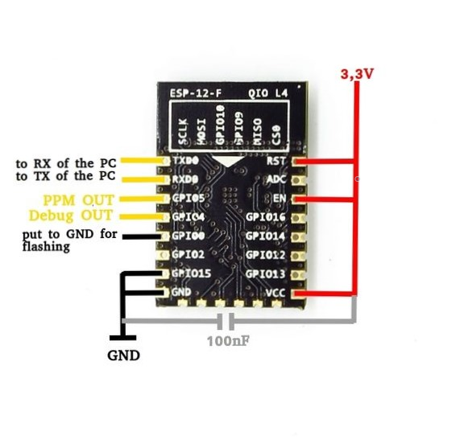

# IoT based ESP wifi PPM reciever for Drones(and other applications)

## Overview

IOT based project for ESP8266 module to be used as an ppm reciever (no controller app needed) for a drone flight controller.

The ESP*12E ESP8266 WiFi Module is a self contained SOC with integrated TCP/IP protocol stack that can give any microcontroller access to your WiFi network. The ESP8266 is capable of either hosting an application or offloading all Wi*Fi networking functions from another application processor.

This gives us an advantage of not needing an external application to send and recieve commands. The program starts a wifi access point with a HTML 5 website to control the PPM signal. The PPM signal is generated by interrupt.

Thanks to HTML5 you can control your RC device with any smart phone without any app. You can also connect to the website with a PC and use a joystick for controlling. At the moment this works only in Firefox.

## Getting Started

These instructions will get you a copy of the project up and running on your ESP8266  for development and testing purposes.

### Part List

* ESP8266: Any module should work. I used the ESP-12E module.

* a 3,3V USB to Serial converter for uploading the scetch the first time. (I used a NodeMCU Amica board).

* a 3,3V voltage regulator: The ESP8266 needs 3,3V. Any voltage above 3,6V will kill the device. It can also drop about 200mA peak current. If you don´t have a strong enough 3,3V supply at your RC model you need an additional voltage regulator.

* a PC with Arduino IDE

* ESP8266 support for Arduino IDE. Follow [these instructions](https://learn.sparkfun.com/tutorials/esp8266-thing-hookup-guide/installing-the-esp8266-arduino-addon).

* Websocket library for Arduino: https://github.com/Links2004/arduinoWebSockets

* Maybe a 3,3V/5V level shifter if your PPM decoder doesn´t support 3,3V inputs. For most Drone flight controllers you don´t need this.

* The WifiPPM scetch: Download file 

* A smart phone or a PC with a joystick and Firefox

### Setting up the Electronics and uploading the Code

<p align="center">

</p>

1. First you need to set the power connections to the ESP8266 module. You can see the wiring in the picture. Make the following connections:

	* RST, EN and VCC to 3,3V

	* GPIO15 and GND to GND

	* Put a small capacitor between VCC and GND (about 100 nF)

	* TXD to RXD of your USB2Serial device

	* RXD to TXD of your USB2Serial device

	* Put GPIO0 to GND while powerup to enter the flash mode.

2. After you have installed the Arduino IDE, the ESP8266 support and the websocket library open the sketch. Hold GIO0 to GND while powering up the ESP8266 to enter the flash mode. Now you can upload the sketch.

3. After you have uploaded the sketch, the controller will reset. You should find a WIFI Access Point named WifiPPM. If this is OK you can power down the chip and disconnect the TXD, RXD and GPIO0 wires. In the future you can update the program over OTA. To do so connect to the Access Point and go to "192.168.1.4/update" in your web browser.

```diff
- NOTE: YOU MAY WANT TO CHANGE THE ACCESS POINT NAME AND PASSWORD IN THE CODE BEFORE UPLOADING THE SKETCH.
```

### Connecting to the Website

Now you can connect GPIO5 to the PPM input of your flight controller or whatever you use to decode the PPM signal.

  * After powering up the module you can connect to the Access Point "WifiPPM". There is no password. Open the address 192.168.4.1 in your browser.

  * You will see the site of the first picture. On a touch device you can control the sticks with your touch screen.

  * If you open the site with a PC you must use Firefox. As soon as you connect a joystick, the site will change to the one you can see at the second picture. You can control the sticks with your joystick.

### Setting Up Betaflight

I use the WifiPPM controller for my quadcopter with Betaflight. I explain now how to set it up.

  * Connect your flight controller to the PC

  * open Betaflight

  * connect to the flight controller

  * go to Receiver tab

  * type RTAE1234 into the channel map field

  * change the "Stick Low Threshold" to 1020, the "Stick Center" to 1500 and the "Stick High Threshold" to 1980

  * save the changes

  * open the wifiPPM website with your mobile phone and test if the adjustment is OK

Thats it. You are done. Now you can fly with your mobile phone without any additional app.

## Authors

* **Dipanshu Shukla** - *Initial work* - [Github page](https://github.com/DipanshuShukla)

## License

This project is licensed under the MIT License - see the [LICENSE.md](https://github.com/DipanshuShukla/ESP-PPM/blob/master/LICENSE) file for details
